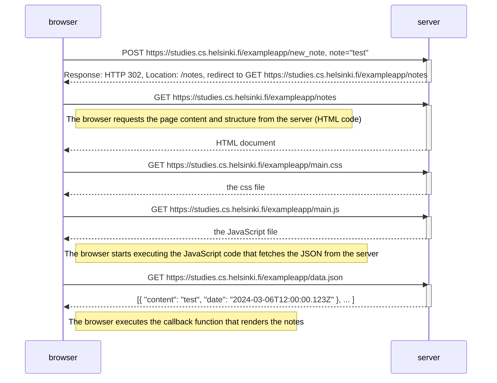
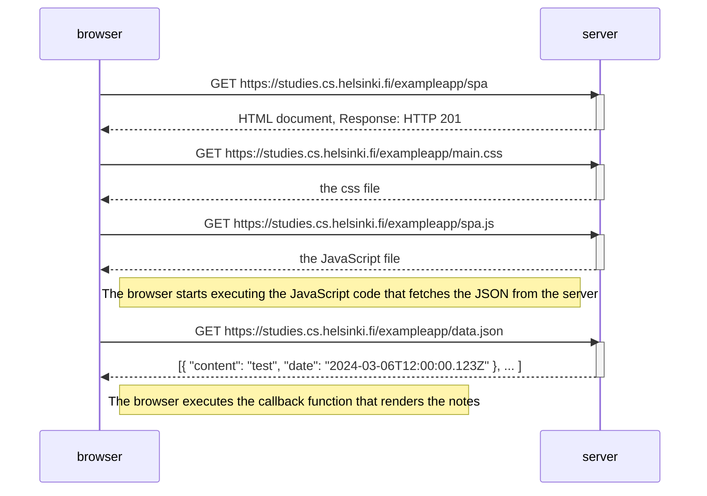
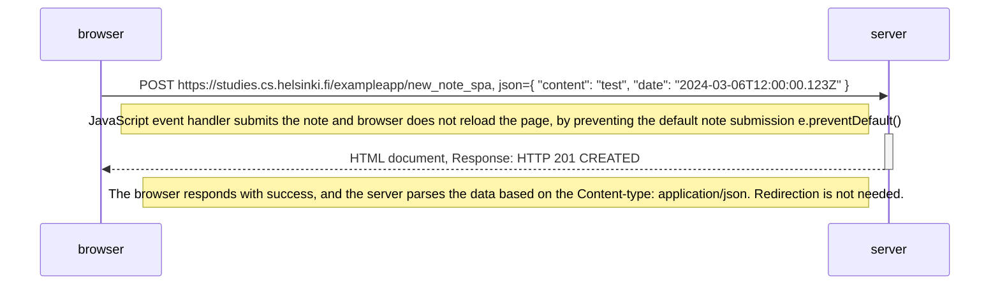

## 0.4: uusi muistiinpano

```mermaid

sequenceDiagram
    participant browser
    participant server
    
    browser->>server: POST https://studies.cs.helsinki.fi/exampleapp/new_note, note="test"
    activate server
    server-->>browser: Response: HTTP 302, Location: /notes, redirect to GET https://studies.cs.helsinki.fi/exampleapp/notes
    deactivate server

    browser->>server: GET https://studies.cs.helsinki.fi/exampleapp/notes
    activate server

    Note right of browser: The browser requests the page content and structure from the server (HTML code)

    server-->>browser: HTML document
    deactivate server

    browser->>server: GET https://studies.cs.helsinki.fi/exampleapp/main.css
    activate server
    server-->>browser: the css file
    deactivate server
    
    browser->>server: GET https://studies.cs.helsinki.fi/exampleapp/main.js
    activate server
    server-->>browser: the JavaScript file
    deactivate server
    
    Note right of browser: The browser starts executing the JavaScript code that fetches the JSON from the server
    
    browser->>server: GET https://studies.cs.helsinki.fi/exampleapp/data.json
    activate server
    server-->>browser: [{ "content": "test", "date": "2024-03-06T12:00:00.123Z" }, ... ]
    deactivate server    

    Note right of browser: The browser executes the callback function that renders the notes 
```

## 0.5: Single Page App

```mermaid

sequenceDiagram
    participant browser
    participant server
    
    browser->>server: GET https://studies.cs.helsinki.fi/exampleapp/spa
    activate server
    server-->>browser: HTML document, Response: HTTP 201
    deactivate server

    browser->>server: GET https://studies.cs.helsinki.fi/exampleapp/main.css
    activate server
    server-->>browser: the css file
    deactivate server
    
    browser->>server: GET https://studies.cs.helsinki.fi/exampleapp/spa.js
    activate server
    server-->>browser: the JavaScript file
    deactivate server
    
    Note right of browser: The browser starts executing the JavaScript code that fetches the JSON from the server
    
    browser->>server: GET https://studies.cs.helsinki.fi/exampleapp/data.json
    activate server
    server-->>browser: [{ "content": "test", "date": "2024-03-06T12:00:00.123Z" }, ... ]
    deactivate server

    Note right of browser: The browser executes the callback function that renders the notes 
```

## 0.6: Uusi muistiinpano

```mermaid

sequenceDiagram
    participant browser
    participant server
    
    browser->>server: POST https://studies.cs.helsinki.fi/exampleapp/new_note_spa, json={ "content": "test", "date": "2024-03-06T12:00:00.123Z" }

    Note right of browser: JavaScript event handler submits the note and browser does not reload the page, by preventing the default note submission e.preventDefault()

    activate server
    server-->>browser: HTML document, Response: HTTP 201 CREATED
    deactivate server

    Note left of server: The browser responds with success, and the server parses the data based on the Content-type: application/json. Redirection is not needed.
```